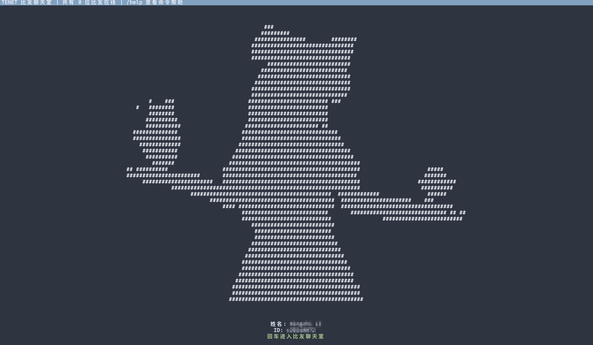
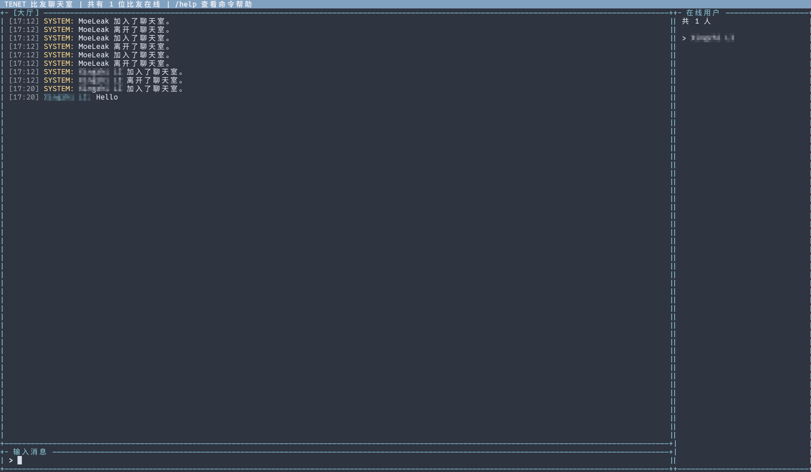

# tenet

TENET 是一个纯 C 写的仅用 POSIX 兼容库的聊天室服务端。




## 构建

```sh
make
```

Bad Apple 动画资源位于 `assets/badapple.delta`。如需重新生成，使用参考项目的 `badapple.txt`：

```sh
tools/generate_badapple_delta.pl badapple.txt assets/badapple.delta
```

安装到系统：

```sh
sudo make install
```

## SSH 部署方式

### Docker Compose 快速启动

复制环境变量模板并按需要选择认证模式：

```sh
cp .env.example .env
$EDITOR .env
```

构建并启动容器：

```sh
docker compose up -d --build
```

Docker volumes 使用固定名称 `tenet_data`、`tenet_home`、`tenet_run`；如果本机已有旧的 `tenet_tenet_*` volume，Docker 不会自动重命名，需要手动迁移后再删除旧 volume。

连接聊天室：

```sh
ssh -p 2222 用户名@localhost
```

首次用 LDAP 密码验证后，可以把本机公钥注册进去，之后就可以免密码进聊天室：

```sh
ssh-copy-id -p 2222 用户名@localhost
ssh -p 2222 用户名@localhost
```

`ssh-copy-id` 会写入容器内该 LDAP 用户的 `~/.ssh/authorized_keys`，Docker Compose 默认用 `tenet_home` volume 持久化 `/home`。独立注册账号同步出的本地 SSH 用户会写入 `/etc/passwd`、`/etc/shadow`、`/etc/group`、`/etc/gshadow`，启动脚本会把这些文件的动态账号部分保存到 `tenet_data` volume 里的 `/var/lib/tenet/system-accounts`，容器重建后会自动恢复。确认所有需要的用户都注册公钥后，可以设置 `TENET_DISABLE_PASSWORD_AUTH=1` 关闭密码登录，只保留公钥登录。

`.env.example` 默认启用 LDAP 模式：

```env
TENET_AUTH_MODE=ldap
TENET_ENABLE_LOCAL_GATEWAY=1
TENET_REGISTRATION_USER=tenet
TENET_LOCAL_GATEWAY_USERS=tenet
TENET_SYNC_LOCAL_SSH_USERS=1
TENET_PERSIST_SYSTEM_ACCOUNTS=1
TENET_SYSTEM_ACCOUNT_DIR=/var/lib/tenet/system-accounts
TENET_SYSTEM_ACCOUNT_MIN_ID=1000
TENET_SYSTEM_ACCOUNT_SYNC_INTERVAL=10
TENET_BOT_USERNAME=tenet-bot
TENET_INTERNAL_USERS=${TENET_BOT_USERNAME:-tenet-bot}
TENET_LDAP_HOST=ldap.example.org
TENET_LDAP_PORT=389
TENET_LDAP_BASE_DN=DC=example,DC=org
TENET_LDAP_USER_FULLNAME_ATTR=displayName
TENET_LDAP_REFERRALS=0
```

LDAP 模式下，容器内 OpenSSH 会通过 PAM/SSSD 接 LDAP，用户用自己的 LDAP 用户名和密码登录。`tenet` 显示的昵称来自 LDAP 的 `displayName`；如果没有该属性，会退回 SSH 登录用户名。如果 LDAP 不允许匿名搜索，还需要在 `.env` 里配置只读查询账号：

```env
TENET_LDAP_BIND_DN=CN=ldap-reader,OU=Service Accounts,DC=example,DC=org
TENET_LDAP_BIND_PASSWORD=reader-password
```

可以设置 `TENET_LDAP_TEST_USER=某个LDAP用户名`，让容器启动时先验证该用户能否被解析；验证失败时容器会直接退出，便于排查 LDAP 配置。

Docker Compose 默认把 `TENET_INTERNAL_USERS` 从 `TENET_BOT_USERNAME` 展开，让内部 bot 通过 Unix socket 直连后端时绕过 LDAP/账号密码校验。这个列表只应该放内部服务用户，不要放普通 SSH 用户。

如果要回到本地测试账号模式，设置：

```env
TENET_AUTH_MODE=local
TENET_USER=tenet
TENET_PASSWORD=change-this-password
```

本地模式会创建 `TENET_USER` 用户，密码来自 `TENET_PASSWORD`。如果你要用公钥登录，把公钥填到 `TENET_AUTHORIZED_KEYS`，然后可设置 `TENET_DISABLE_PASSWORD_AUTH=1` 关闭密码登录。

> 当前 LDAP 默认按 AD 风格配置：`sAMAccountName`、`user`、`group`、自动 ID mapping。若你的 LDAP 不是 AD，可通过 `TENET_LDAP_SCHEMA`、`TENET_LDAP_USER_NAME_ATTR`、`TENET_LDAP_USER_OBJECT_CLASS`、`TENET_LDAP_GROUP_OBJECT_CLASS` 调整。端口 389 会明文传输密码，仅适合可信内网；生产环境建议改用 LDAPS 或 StartTLS。

### 宿主机 OpenSSH

启动 tenet 后端。它默认监听 Unix socket `/tmp/tenet.sock`：

```sh
./tenet --ssh-backend --socket /run/tenet.sock
```

然后让 OpenSSH 在登录后执行 tenet 会话程序。推荐新建一个专用 sshd 配置片段，例如 `/etc/ssh/sshd_config.d/tenet.conf`：

```sshconfig
Match User tenet
    ForceCommand /usr/local/bin/tenet --ssh-session --socket /run/tenet.sock
    PermitTTY yes
    X11Forwarding no
    AllowTcpForwarding no
    PermitTunnel no
```

这样用户连接：

```sh
ssh tenet@服务器地址
```

如果你希望每个真实系统账号登录后都进入聊天室，可以把 `Match User tenet` 换成合适的 `Match Group chat`，并把用户加入该组。认证、密码策略、LDAP/PAM 都交给 OpenSSH/系统处理。

## 调试运行

本地不经过 sshd 也可以测试 SSH 会话模式：

```sh
./tenet --ssh-backend --socket /tmp/tenet.sock
USER=alice ./tenet --ssh-session --socket /tmp/tenet.sock
```

兼容 Telnet 调试模式仍保留：

```sh
./tenet --telnet --port 2323
```

Telnet 调试模式保留旧的内置 LDAP 密码登录；SSH 模式外层由 sshd/PAM 认证，后端只查询 LDAP 来决定是否需要切换到 tenet 独立账号。

SSH 连接仍优先由 OpenSSH/LDAP 完成认证。进入后端后，tenet 会查询当前 SSH 用户是否存在于 LDAP：如果存在，直接使用该 LDAP 用户进入聊天室；如果是已注册的 tenet 独立账号，也会直接进入；只有 SSH 用户是 `tenet` gateway 时才会显示独立账号登录/注册页。

独立注册入口固定走 Docker 本地 gateway：设置 `TENET_USER=tenet`、`TENET_PASSWORD=tenet`、`TENET_REGISTRATION_USER=tenet`、`TENET_LOCAL_GATEWAY_USERS=tenet`、`TENET_SYNC_LOCAL_SSH_USERS=1`、`TENET_PERSIST_SYSTEM_ACCOUNTS=1`。第一次用 `ssh tenet@host` 和 `TENET_PASSWORD` 进入注册页；注册账号（例如 `moeleak`）后，tenet 会同步创建同名 SSH 本地用户，并把 `/etc/passwd`/`/etc/shadow` 等账号文件保存到 `tenet_data` volume。之后直接用 `ssh moeleak@host` 和注册时设置的密码进入聊天室，这套账号相对于 LDAP 独立；如果 LDAP 中已存在同名账号，则不能注册同 ID 的 tenet 独立账号。其他未注册、非 LDAP 的 SSH 用户不会显示注册页。

## 常用选项

```text
--ssh-backend            启动 OpenSSH ForceCommand 后端，默认模式
--ssh-session            作为 SSH 会话连接本机后端
--socket PATH            Unix socket 路径，默认 /tmp/tenet.sock
--telnet                 兼容调试模式：启动旧 Telnet 监听
--bind ADDR              Telnet 模式监听地址，默认 0.0.0.0
--port PORT              Telnet 模式端口，默认 2323
--max-clients N          最大在线人数，默认 64
--no-ldap                Telnet 调试模式关闭 LDAP
--ldap-host HOST         LDAP 地址，默认 ldap.example.org
--ldap-port PORT         LDAP 端口，默认 389
--ldap-base-dn DN        BaseDN，默认 DC=example,DC=org
--ldap-timeout SEC       LDAP 超时秒数，默认 5
--ldap-search            Telnet 模式先搜索用户 DN 再绑定验证
--ldap-bind-dn DN        搜索模式的 LDAP 绑定 DN
--ldap-bind-password PW  搜索模式的 LDAP 绑定密码
--local-user-db PATH     tenet 聊天账号库，默认 tenet-users.db
--internal-users LIST    允许从 Unix socket 直连的内部服务用户列表
--sync-local-ssh-users   注册时同步创建同名 SSH 本地用户
```

Docker 中默认开启 `TENET_PERSIST_SYSTEM_ACCOUNTS=1`。不要直接把宿主机的 `/etc/passwd` 或 `/etc/shadow` 挂进容器；tenet 会在启动时从 `TENET_SYSTEM_ACCOUNT_DIR` 合并 UID/GID 不小于 `TENET_SYSTEM_ACCOUNT_MIN_ID` 的动态账号，保留镜像自带系统账号。

也可用环境变量配置，例如：

```sh
TENET_SOCKET=/run/tenet.sock ./tenet --ssh-backend
```

## 聊天命令

```text
/help        显示帮助
/list        查看在线用户
/pm <USER>   按用户 ID 打开私聊，支持 Tab 补全
/msg <USER> <TEXT>  按用户 ID 发送一次私聊，支持 Tab 补全，不切换当前聊天
/close       关闭当前私聊标签；大厅不能关闭
/me TEXT     发送动作消息
/quit        退出聊天室
```

输入框支持 Readline 风格快捷键：`Ctrl-A/E/B/F`、`Alt-B/F`、`Ctrl-W`、`Ctrl-U/K`、上下历史和左右方向键；`Ctrl-C` 有内容时清空当前输入，空输入时退出。

## systemd 示例

```ini
[Unit]
Description=tenet chat backend
After=network.target

[Service]
ExecStart=/usr/local/bin/tenet --ssh-backend --socket /run/tenet.sock
Restart=always
RuntimeDirectory=tenet

[Install]
WantedBy=multi-user.target
```

如果使用 `RuntimeDirectory=tenet`，把 socket 路径改成 `/run/tenet/tenet.sock`，并在 sshd `ForceCommand` 中使用同一路径。

## tenet-bot

`tenet-bot` 是 tenet 的本地 AI 客户端。它通过 Unix socket 以普通 tenet 用户接入聊天室；大厅里默认只响应 `@tenet-bot` 提及，私聊里无需 `@` 也会回复，并调用本机 Ollama：

- 聊天模型：`qwen3.5:9b`
- Embedding 模型：`qwen3-embedding:4b`
- Ollama URL：`http://127.0.0.1:11434`
- 记忆库：`tenet-bot-memory.sqlite3`

推荐先进入 Nix 开发环境，它会提供 SQLite、sqlite-vss、Ollama 和构建工具，并自动导出 sqlite-vss 扩展路径；如果没有 sqlite-vss，bot 会回退到 SQLite 扫描检索：

```sh
nix develop path:$PWD
make
```

也可以在非 Nix 环境安装 `sqlite3` 开发库后构建；`sqlite-vss` 是可选加速：

```sh
make tenet-bot
```

本地启动示例（`tenet-bot` 会自动读取当前目录 `.env`）：

```sh
ollama pull qwen3.5:9b
ollama pull qwen3-embedding:4b
TENET_INTERNAL_USERS=tenet-bot ./tenet --ssh-backend --socket /tmp/tenet.sock
./tenet-bot --socket /tmp/tenet.sock
```

常用选项：

```text
--ollama-url URL           Ollama URL
--memory-db PATH           SQLite 记忆库路径
--vector-extension PATH    sqlite-vss vector0 扩展路径
--vss-extension PATH       sqlite-vss vss0 扩展路径
--context-messages N       每次请求带最近 N 条上下文，默认 12，内部最多使用 16 条
--memory-top-k N           全局/用户长期记忆各检索 N 条，默认 6
--reset-memory             清空长期记忆后启动
```

Docker Compose 会从 `.env` 注入 `TENET_BOT_USERNAME`、`TENET_BOT_DISPLAY_NAME`、`TENET_BOT_OLLAMA_URL`、`TENET_BOT_CHAT_MODEL` 和 `TENET_BOT_EMBED_MODEL`；默认用 `http://host.docker.internal:11434` 访问宿主机 Ollama。LDAP 模式下，如果手动设置 `TENET_INTERNAL_USERS`，需要包含 `TENET_BOT_USERNAME`。

```sh
cp .env.example .env
$EDITOR .env
docker compose up -d --build
```

`tenet-bot` 通过结构化 Unix socket 协议接收消息，不读取终端屏幕或 ANSI UI；私聊事件只会触发私聊回复，不会同步到大厅。

`tenet-bot` 会把每次问答写入 SQLite，同时写入全局记忆和该用户记忆；后续请求会先用 `/api/embed` 做向量检索，把相关记忆和摘要放进 `system` 消息，再把最近聊天记录作为 `/api/chat` 的 `messages[]` 逐条传入，不再拼接成 `bot 答:` 这类文本 prompt。
